# Phishing para Facebook

# What is phishing? 🤔
_The Phishing Term is used to refer to one of the most used methods by **cyber criminals** to scam and obtain confidential information fraudulently such as a password or specific information about credit cards or other bank information of the victim._

# Basic steps 📖
_In the following guide I will talk about phishing, a method by which “an evil person” **duplicates** a
web that we access through **username** and **password**, and makes our credentials in
instead of reaching the original, they are stored on your server._

⚠**NOTE:** _Use this guide with all relevant safety measures, for academic and **non-criminal use**.:_

### 1. Create the html of facebook: 📋

 We go to the Facebook page.
 
  
  
 In any blank space click with the button right mouse to get the context menu and select the option _“See source code of the page"_.
 
 
 
### 2. Text editor: 📋
We copy the code and add it to a text editor file in my case visual studio code, and save with the name “index.html"


### 2.1 Action: 📋
In the text editor, let's look for the _action =_ statement, if you use visual studio you must press :```ctrl+f```.


### 2.1.1 Action: 📋
Replace the indexxed link in the action method with: ```script.php```.

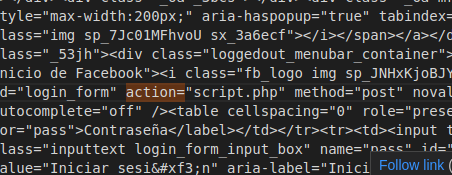

### 3. Script: 📋
Now we are going to create the script, programmed in php. This script generates a ```log.txt``` file with the data collected.


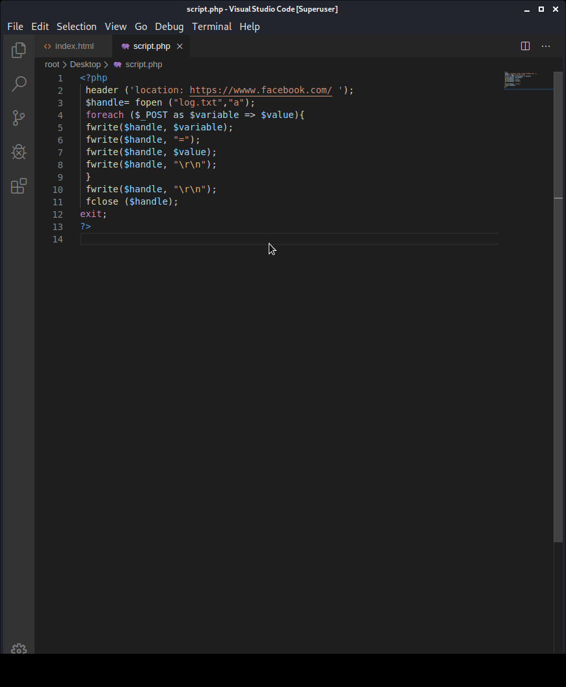

### 4. Web Hosting: 📋
To generate a hosting and domain for our practice, we will use [000webhost](https://co.000webhost.com/) from which we will create a free website.
 
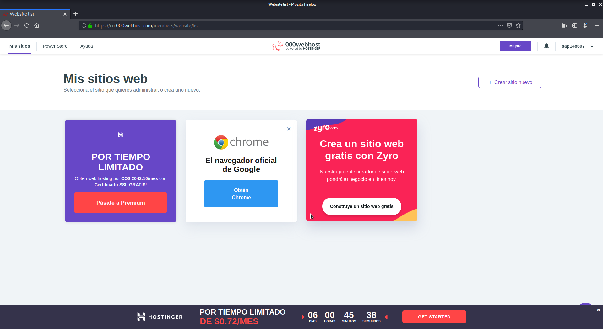


### 4.1 New site: 📋
Configure the requested data of our website.
 
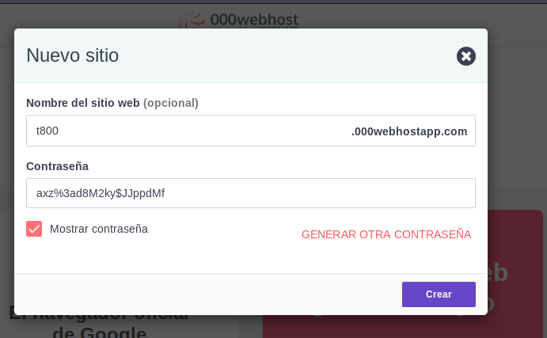


### 4.1. 1 Upload files : 📋
We load the scripts that we have programmed previously, that is the ```index.html``` and the ```script.php```.  


Upload the files:

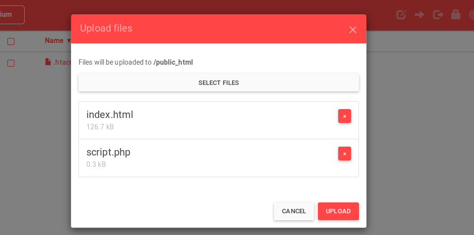

Verify that the files have been uploaded.

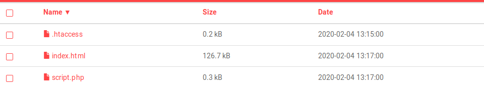

### 5. Page  : 📋
We share the url of the page for users to enter.

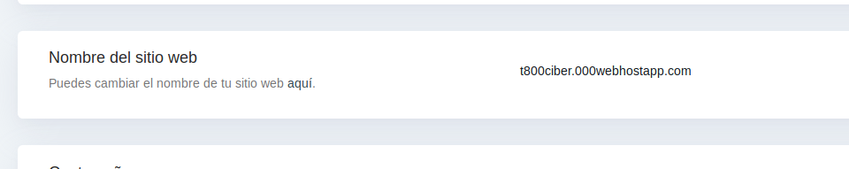

### 5.1 User: 📋
Followed by which will be redirected to the facebook homepage.

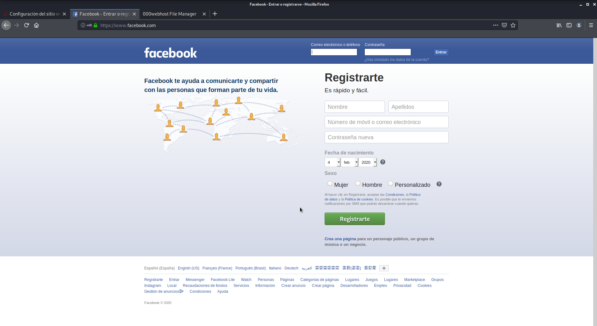

### 6. Data generated: 📋
On our host site, a file with the name ```log.txt``` was created.

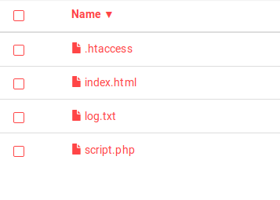

### 6.1 Verify: 📋
We can verify the generated file.

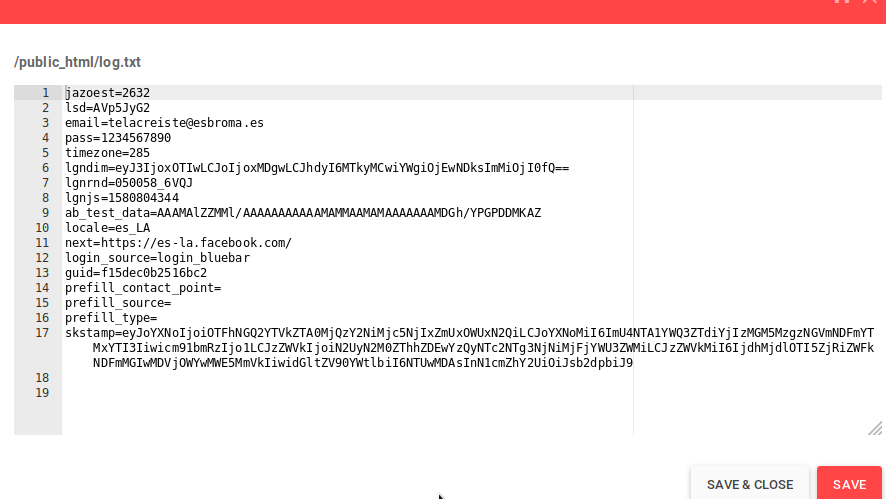

And here we have the user's credentials.

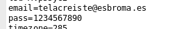


## Author ✒️

* **Nico Patalagua** - *Repository* - [Github](https://github.com/NicoPatalagua)

## If you liked this repostory 🎁
* Share it 📢
* Invite me a beer 🍺  
* Improve it 🤓.

---
## By 📌
[NicoPatalagua](https://www.instagram.com/nicopatalagua/) 😎
