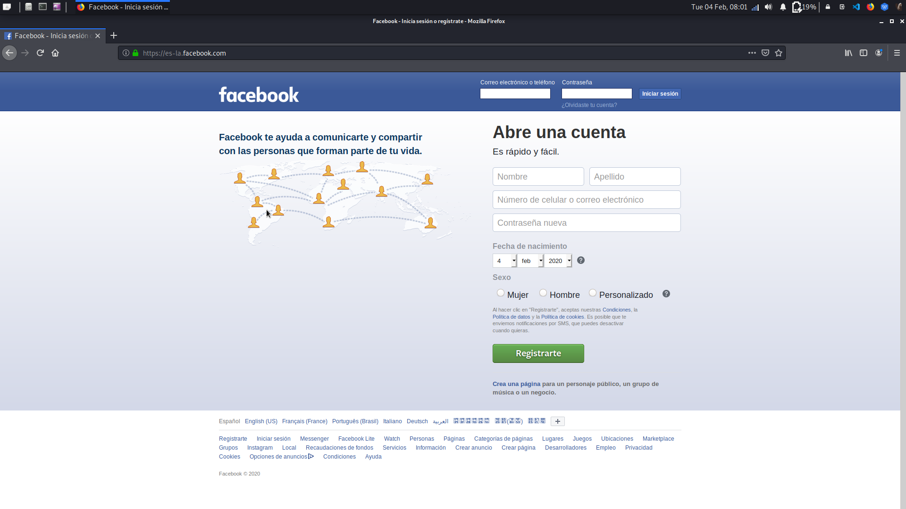
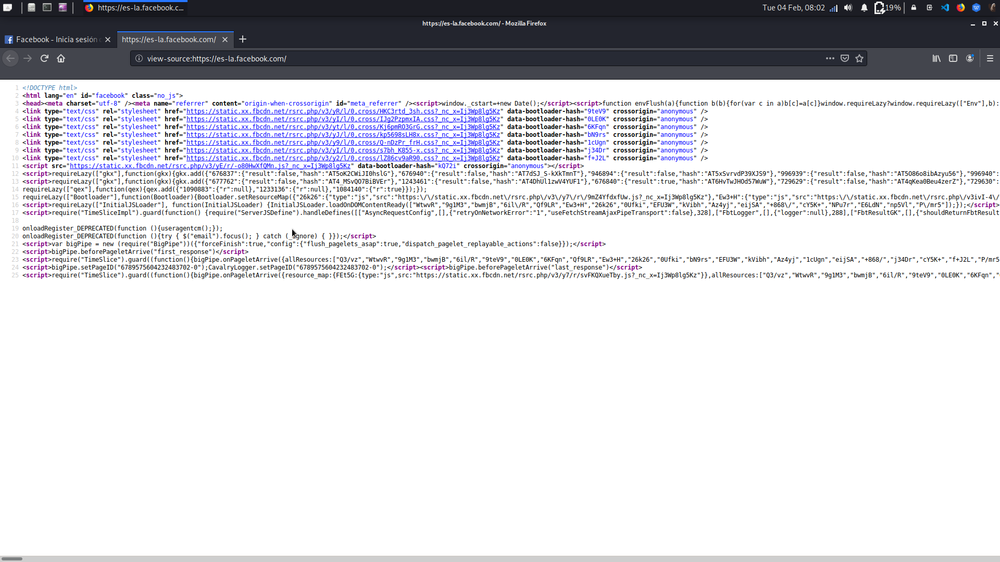
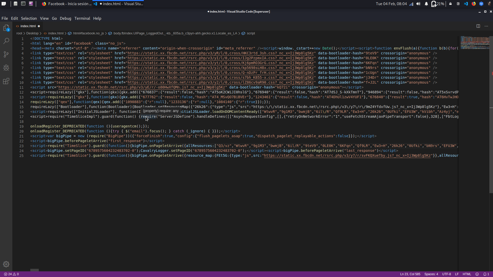
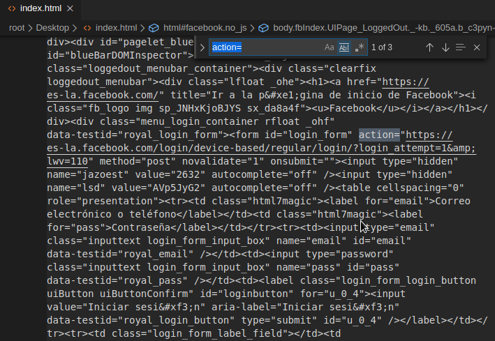

# Phishing para Facebook

# What is phishing? 🤔
_The Phishing Term is used to refer to one of the most used methods by **cyber criminals** to scam and obtain confidential information fraudulently such as a password or specific information about credit cards or other bank information of the victim._

# Basic steps 📖
_In the following guide I will talk about phishing, a method by which “an evil person” **duplicates** a
web that we access through **username** and **password**, and makes our credentials in
instead of reaching the original, they are stored on your server._

⚠**NOTE:** _Use this guide with all relevant safety measures, for academic and **non-criminal use**.:_

### 1. Create the html of facebook: 📋

 We go to the Facebook page.
 
  
  
 In any blank space click with the button right mouse to get the context menu and select the option _“See source code of the page"_.
 
 
 
### 2. Text editor: 📋
We copy the code and add it to a text editor file in my case visual studio code, and save with the name “index.html"



### 2.1 Action: 📋
In the text editor, let's look for the _action =_ statement, if you use visual studio you must press :```ctrl+f```.



---

## Author ✒️

* **Nico Patalagua** - *Repository* - [Github](https://github.com/NicoPatalagua)

## If you liked this repostory 🎁
* Share it 📢
* Invite me a beer 🍺  
* Improve it 🤓.

---
## By 📌
[NicoPatalagua](https://www.instagram.com/nicopatalagua/) 😎
